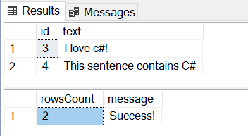

# Regex Sample
This sample shows you how to use SQL Server Language Extensions to create a .NET Core C# program that receives two columns (ID and text) from SQL Server and a regular expression as an input parameter. The class returns two columns back to SQL Server (ID and text).

For a given text in the text column sent to the .NET Core C# program, the code checks if the given regular expression is fulfilled, and if it is fulfilled, it returns that text together with the original ID.

This particular sample uses a regular expression that checks if a text contains the word "C#" or "c#".

## Sample files

* RegexSample.cs - This is the class containing the C# code that will be invoked from SQL Server.
* RegexSample.csproj - This is the project file with compilation information.
* dotnet-core-CSharp-regex-win.sql - SQL file containing T-SQL script for configuring and creating test data and calling the .NET Core C# sample program.

## Prerequisites

+ SQL Server 2019 CU3+ Database Engine instance with the extensibility framework and enable external scripts: `sp_configure 'external scripts enabled', 1;
RECONFIGURE WITH OVERRIDE;`.

+ SQL Server Management Studio or Azure Data Studio for executing T-SQL.

+ [.NET 5.0 SDK](https://dotnet.microsoft.com/download/dotnet/5.0) on Windows.

## Download required files

1. Download the [release](https://github.com/microsoft/sql-server-language-extensions/releases) containing the language extension. If you have any changes to the language extension, then follow this [tutorial](../../README.md) to create **dotnet-core-CSharp-lang-extension.zip**. This file contains the **nativecsharpextension.dll** and **Microsoft.SqlServer.CSharpExtension.dll**.
2. Unzip **dotnet-core-CSharp-lang-extension.zip**. Be sure to keep both **dotnet-core-CSharp-lang-extension.zip** and the unzipped folder.

## Create sample data

First, create a new database and populate a **testdata** table with **ID** and **text** columns.

```sql
CREATE DATABASE csharptest
GO
USE csharptest
GO

CREATE TABLE testdata (
    [id] int,
    [text] varchar(100),
)
GO

INSERT INTO testdata(id, "text") VALUES (4, 'This sentence contains C#')
INSERT INTO testdata(id, "text") VALUES (1, 'This sentence does not')
INSERT INTO testdata(id, "text") VALUES (3, 'I love c#!')
INSERT INTO testdata(id, "text") VALUES (2, NULL)
GO
```

## Create the main class

In this step, create a class file called **RegexSample.cs** and copy the following C# code into that file. You need to extend AbstractSqlServerExtensionExecutor for any main class you create.

[RegexSample.cs](./pkg/RegexSample.cs) is already included in this sample.

```cs
using System;
using System.Runtime.InteropServices;
using System.Collections.Generic;
using Microsoft.Data.Analysis;
using Microsoft.SqlServer.CSharpExtension.SDK;
using System.Text.RegularExpressions;

namespace UserExecutor
{
    /// <summary>
    /// This class extends the AbstractSqlServerExtensionExecutor and uses
    /// a regular expression that checks if a text contains the word "C#" or "c#"
    /// </summary>
    public class CSharpRegexExecutor: AbstractSqlServerExtensionExecutor
    {
        /// <summary>
        /// This method overrides the Execute method from AbstractSqlServerExtensionExecutor.
        /// </summary>
        /// <param name="input">
        /// A C# DataFrame contains the input dataset.
        /// </param>
        /// <param name="sqlParams">
        /// A Dictionary contains the parameters from SQL server with name as the key.
        /// </param>
        /// <returns>
        /// A C# DataFrame contains the output dataset.
        /// </returns>
        public override DataFrame Execute(DataFrame input, Dictionary<string, dynamic> sqlParams){
            // Drop NULL values and sort by id
            //
            input = input.DropNulls().OrderBy("id");

            // Create empty output DataFrame with two columns
            //
            DataFrame output = new DataFrame(new PrimitiveDataFrameColumn<int>("id", 0), new StringDataFrameColumn("text", 0));

            // Filter text containing specific substring using regex expression
            //
            DataFrameColumn texts = input.Columns["text"];
            for(int i = 0; i < texts.Length; ++i)
            {
                if(Regex.IsMatch((string)texts[i], sqlParams["@regexExpr"]))
                {
                    output.Append(input.Rows[i], true);
                }
            }

            // Modify the parameters
            //
            sqlParams["@rowsCount"]  = output.Rows.Count;
            sqlParams["@regexExpr"] = "Success!";

            // Return output dataset as a DataFrame
            //
            return output;
        }
    }
}
```

## Compile and create a .dll file
Package your classes and dependencies into a `.dll` files. You can create a `.csproj` file called **RegexSample.csproj** and copy the following code into that file.

Replace **[path]\Microsoft.SqlServer.CSharpExtension.dll** with the path to the **Microsoft.SqlServer.CSharpExtension.dll** (found inside the unzipped folder from [Download required files](#download-required-files)) to find the implementation of the sdk AbstractSqlServerExtensionExecutor.

[RegexSample.csproj](./pkg/RegexSample.csproj) is already included in this sample. The sample uses a relative path to Microsoft.SqlServer.CSharpExtension.dll.

```xml
<Project Sdk="Microsoft.NET.Sdk">
  <PropertyGroup>
    <TargetFramework>net5.0</TargetFramework>
    <AllowUnsafeBlocks>true</AllowUnsafeBlocks>
    <EnableDynamicLoading>true</EnableDynamicLoading>
  </PropertyGroup>
  <PropertyGroup>
    <OutputPath>$(BinRoot)/$(Configuration)/</OutputPath>
    <AppendTargetFrameworkToOutputPath>false</AppendTargetFrameworkToOutputPath>
  </PropertyGroup>
  <ItemGroup>
    <PackageReference Include="Microsoft.Data.Analysis" Version="0.4.0" />
  </ItemGroup>
  <ItemGroup>
    <Reference Include="Microsoft.SqlServer.CSharpExtension.SDK">
      <HintPath>[path]\Microsoft.SqlServer.CSharpExtension.dll</HintPath>
    </Reference>
  </ItemGroup>
</Project>
```

Go to the folder [pkg](./pkg), and run `dotnet build` which will generate:\
        - PATH\TO\ENLISTMENT\language-extensions\dotnet-core-CSharp\sample\regex\pkg\obj\Debug\RegexSample.dll

## Create external language

You need to create an external language in the database. The external language is a database scoped object, which means that external languages like C# need to be created for each database you want to use it in.

### Create external language on Windows

If you are using Windows, follow the steps below to create an external language for .NET.

1. Create an external language Dotnet from the .zip that was created in [Download required files](#download-required-files):

    ```sql
    CREATE EXTERNAL LANGUAGE Dotnet
    FROM
    (CONTENT = N'<path>\dotnet-core-CSharp-lang-extension.zip', FILE_NAME = 'nativecsharpextension.dll' );
    GO
    ```

### Permissions to execute external language
To execute .NET C# code, the user SID [S-1-15-2-1](https://docs.microsoft.com/en-us/openspecs/windows_protocols/ms-dtyp/81d92bba-d22b-4a8c-908a-554ab29148ab) "<<i>LocalMachineName</i>>\ALL APPLICATION PACKAGES" needs to be granted read permissions to the \MSSQL folder.
1. Right-click the folder and choose **Properties** > **Security**.
2. Click **Edit**.
3. Click **Add**.
4. In **Select Users, Computer, Service Accounts, or Groups**:
   1. Click **Object Types** and make sure *Built-in security principles* and *Groups* are selected.
   2. Click **Locations** to select the local computer name at the top of the list.
5. Enter **ALL APPLICATION PACKAGES**, check the name, and click OK to add.
    If the name doesn't resolve, revisit the Locations step. The SID is local to your machine.

## Create external libraries
Create an external library for the RegEx code.

```sql
CREATE EXTERNAL LIBRARY [regex.dll]
FROM (CONTENT = N'<path>\RegexSample.dll')
WITH (LANGUAGE = 'Dotnet');
GO
```

## Call the .NET Core C# class
Call the [stored procedure](https://docs.microsoft.com/en-us/sql/relational-databases/system-stored-procedures/sp-execute-external-script-transact-sql?view=sql-server-ver15) `sp_execute_external_script` to invoke the C# code from SQL Server. In the **script** parameter, define which `libraryname;namespace.classname` you want to call. You can also define which `namespace.classname` you want to call without sepcifying the library name. The extension will find the first library that has the matched `namespace.classname`.
In the code below, the class belongs to a namespace called **UserExecutor** and a class called **CSharpRegexExecutor**.

> [!NOTE]
> The code is not defining which method to call. By default, the **execute** method will be called. This means that you need to follow the SDK interface and implement an execute method in your C# class, if you want to be able to call the class from SQL Server.

The stored procedure takes an input query (input dataset) and a regular expression and returns the rows that fulfilled the given regular expression. It uses a regular expression `[Cc]#` that checks if a text contains the word **C#** or **c#**.

```sql
declare @rowsCount int
declare @regexExpr varchar(200)
set @regexExpr = N'[Cc]#'

EXEC sp_execute_external_script
  @language = N'Dotnet'
, @script = N'regex.dll;UserExecutor.CSharpRegexExecutor'
, @input_data_1 = N'SELECT * FROM testdata'
, @params = N'@regexExpr varchar(200) OUTPUT, @rowsCount int OUTPUT'
, @regexExpr =  @regexExpr OUTPUT
, @rowsCount = @rowsCount OUTPUT
with result sets ((id int, text varchar(100)));

select @rowsCount as rowsCount, @regexExpr as message
```

### Results

After executing the call, you should get a result set with two of the rows and another set with new value of parameters @rowsCount and @regexExpr.


